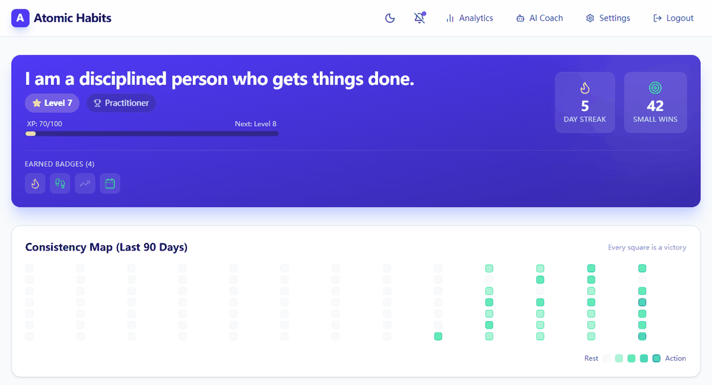
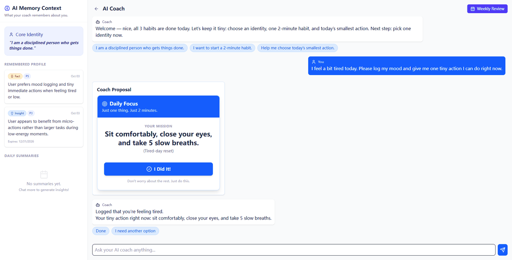
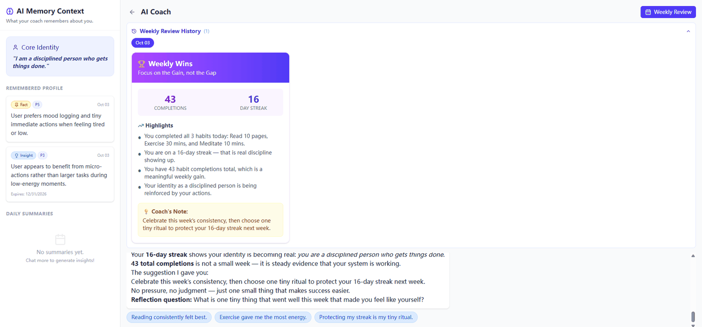
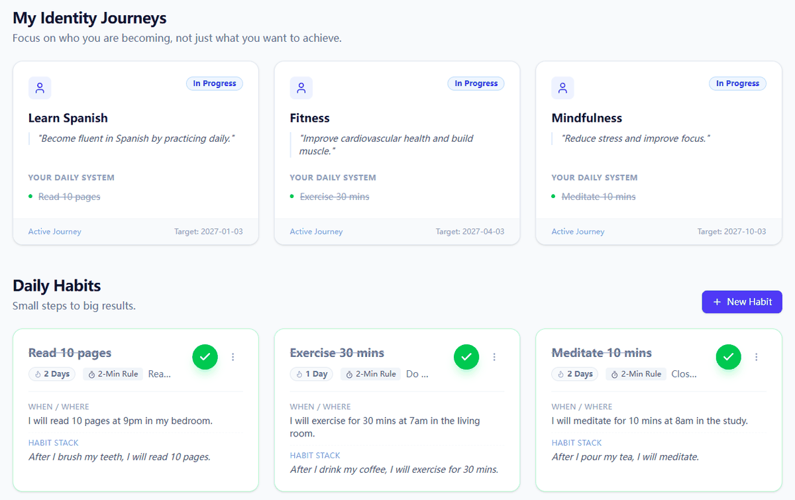
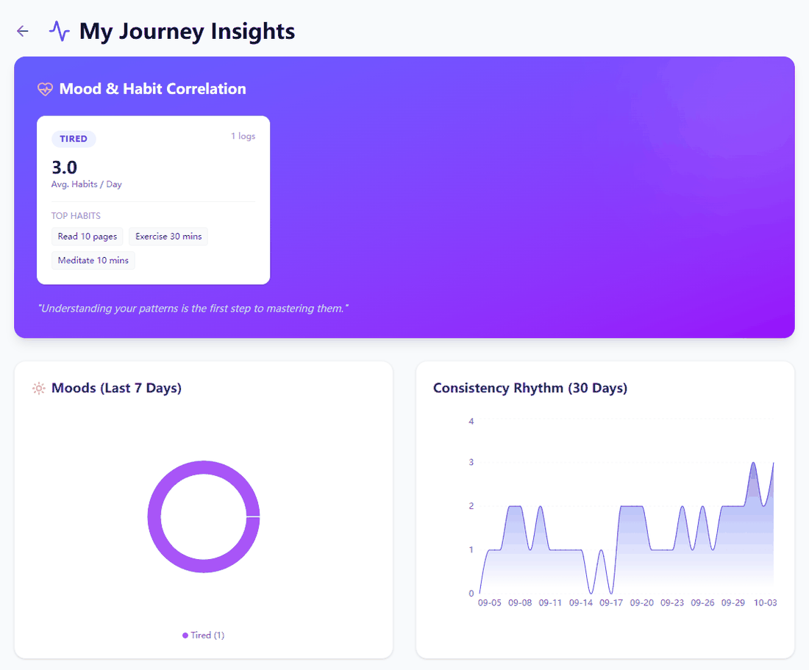
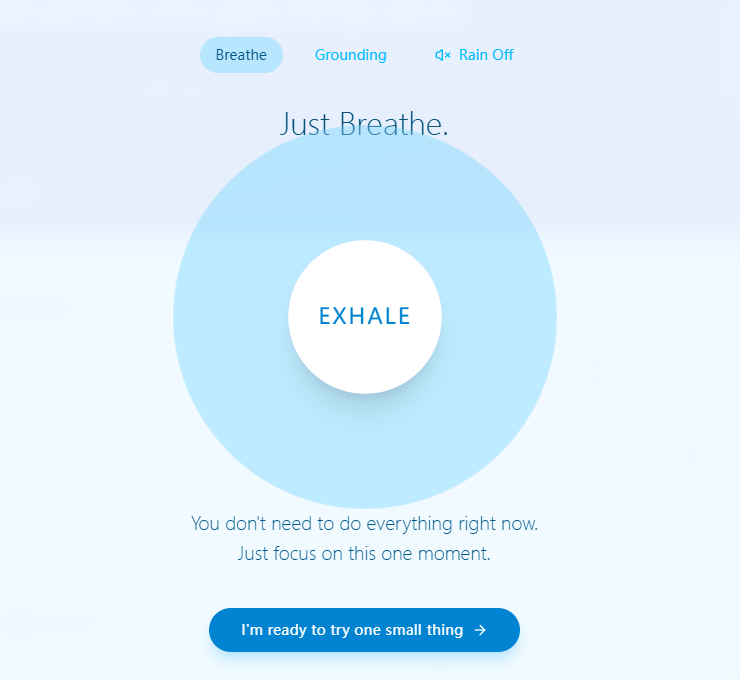
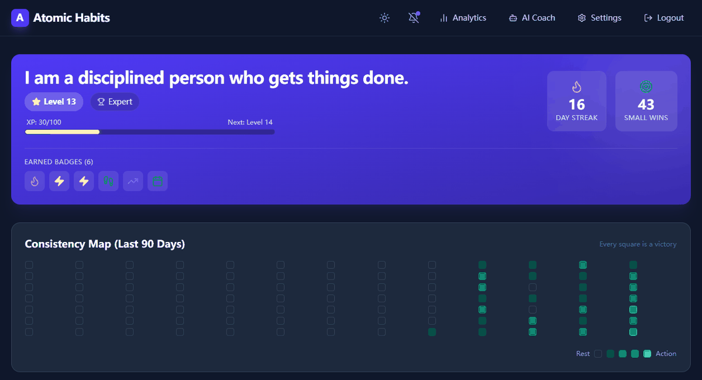

# Atomic Habit: An AI-Powered Habit Tracker for a Kinder, More Consistent You

[](https://github.com/inwardflow/atomic-habit/actions/workflows/ci.yml) [](https://github.com/inwardflow/atomic-habit/releases) [](https://github.com/inwardflow/atomic-habit/actions/workflows/codeql.yml) [](https://github.com/inwardflow/atomic-habit/blob/master/LICENSE)

**Atomic Habit** is a full-stack, open-source habit tracking application built on the principles of James Clear's book of the same name. It's designed to be a powerful, yet gentle tool for building a better life, one tiny habit at a time.

<p align="center">
  
</p>

---

## The Philosophy: Why Another Habit Tracker?

Most habit trackers are about streaks, pressure, and perfection. They can feel great when you're on a roll, but demoralizing when life gets in the way. A missed day can feel like a total failure, causing many to abandon their goals altogether.

**This project is different.**

We focus on the core principles of *Atomic Habits*: making habits **obvious, attractive, easy, and satisfying**. Our goal is not to build unbreakable streaks, but to lower the friction to getting back on track. It's a tool for imperfect people living real lives.

Key philosophical differences:

*   **Focus on Identity**: The app is built around the idea of casting "votes" for your desired identity, rather than just checking boxes.
*   **2-Minute Rule as a First-Class Citizen**: Every habit can have a "2-minute version," making it easy to show up even on your worst days.
*   **Anxiety-Friendly Design**: Features like "Panic Mode" provide immediate, guided relief when you're overwhelmed, shifting focus from productivity to well-being.
*   **AI as a Coach, Not a Taskmaster**: The integrated AI Coach is designed to be a supportive partner, helping you reflect, strategize, and find the smallest possible step forward, especially when you're stuck.

## ✨ Features

This application is more than just a to-do list. It's a comprehensive system for mindful habit formation.

| Feature                 | Description                                                                                                                               |
| ----------------------- | ----------------------------------------------------------------------------------------------------------------------------------------- |
| **🤖 AI Coach**         | An integrated AI assistant (powered by AgentScope) that helps you define goals, break down habits, and get back on track when you feel stuck. |
| **📊 Habit Dashboard**    | A clear, focused view of your daily habits. See what's scheduled, what's completed, and cast your "votes" for your new identity.            |
| **📈 Analytics Page**     | Visualize your progress over time with heatmaps and charts. Understand your consistency and celebrate your long-term progress.             |
| **🏆 Gamification System**  | Earn badges and level up your "Identity Score" as you build habits. Turns the process into a satisfying and motivating journey.         |
| **🔔 Notification System**  | Gentle, configurable reminders to help you stay on track without being intrusive.                                                       |
| **🧘 Panic Mode**          | An anxiety-friendly feature that guides you through breathing exercises and grounding techniques when you feel overwhelmed.                 |
| **👁️ Agent Visualization**  | See exactly what the AI Coach is doing in real-time (Thinking, Calling Tools, Reading Memory), providing transparency and building trust. |

## 📸 Screenshots

<table>
  <tr>
    <td width="50%"></td>
    <td width="50%"></td>
  </tr>
  <tr>
    <td align="center"><b>AI Coach</b>: tool-using agent with long-term memory and visual cards</td>
    <td align="center"><b>Compassionate Weekly Review</b>: focus on the gain, not the gap</td>
  </tr>
  <tr>
    <td></td>
    <td></td>
  </tr>
  <tr>
    <td align="center"><b>Identity Journeys &amp; Daily Habits</b>: 2-minute rule, cues and habit stacking</td>
    <td align="center"><b>Analytics</b>: mood/habit correlation and consistency rhythm</td>
  </tr>
  <tr>
    <td></td>
    <td></td>
  </tr>
  <tr>
    <td align="center"><b>Panic Mode</b>: guided breathing and grounding when overwhelmed</td>
    <td align="center"><b>Dark mode</b> and English / 中文 UI</td>
  </tr>
</table>

## 🛠️ Tech Stack

This project is built with a modern, robust, and scalable technology stack.

**Backend:**
*   **Framework**: Spring Boot 3.5 (Java 17)
*   **AI Integration**: [AgentScope](https://github.com/modelscope/agentscope) for creating and managing AI agents.
*   **API**: RESTful API with SSE (Server-Sent Events) for real-time AI chat streaming.
*   **Authentication**: JWT-based security with Spring Security.
*   **Database**: JPA/Hibernate with PostgreSQL (production, schema managed by Flyway migrations in `backend/src/main/resources/db/migration`) and H2 (local development).
*   **Build**: Maven (via the bundled Maven Wrapper), JaCoCo for coverage

**Frontend:**
*   **Framework**: React 19 with Vite
*   **Language**: TypeScript
*   **Styling**: TailwindCSS for a utility-first CSS workflow.
*   **State Management**: Zustand for simple, scalable state management.
*   **Data Visualization**: Recharts for analytics charts and heatmaps.
*   **UI Components**: Lucide Icons, Framer Motion for animations.

**AI Service:**
*   Works with any OpenAI-compatible chat-completions endpoint that supports tool calling.
*   Defaults to **SiliconFlow** (`deepseek-ai/DeepSeek-V3.2`); also tested with Alibaba Cloud Qwen (`qwen3.8-flash`).
*   Model calls are non-streaming on the server side, because some providers emit malformed streamed tool-call deltas.

**Deployment:**
*   **Containerization**: Docker & Docker Compose for easy local and production setup.
*   **CI/CD**: GitHub Actions for tests, coverage, Docker image builds, CodeQL scanning and dependency review.

## 🚀 Getting Started

Follow these instructions to get the project running on your local machine for development and testing purposes.

### Prerequisites

Make sure you have the following software installed:

*   **Java 17+** (We recommend [SDKMAN!](https://sdkman.io/) for managing Java versions)
*   **Maven** is optional; use the bundled wrapper (`./mvnw`)
*   **Node.js 20+** (We recommend [nvm](https://github.com/nvm-sh/nvm) for managing Node.js versions)
*   **Docker & Docker Compose** (For the easiest, most consistent setup)

### 1. Clone the Repository

```bash
git clone https://github.com/inwardflow/atomic-habit.git
cd atomic-habit
```

### 2. Configure Environment Variables

The project uses environment variables for all sensitive configurations. Start by copying the example file:

```bash
cp .env.example .env
```

Now, open the `.env` file and fill in the required values. **At a minimum, you must provide `AGENTSCOPE_MODEL_API_KEY` for the AI Coach to function.**

| Variable                      | Description                                                                 |
| ----------------------------- | --------------------------------------------------------------------------- |
| `AGENTSCOPE_MODEL_API_KEY`    | **Required.** Your API key from an OpenAI-compatible service (e.g., SiliconFlow). |
| `AGENTSCOPE_MODEL_BASE_URL`   | The base URL of the AI service. Defaults to SiliconFlow.                    |
| `AGENTSCOPE_MODEL_NAME`       | The specific model to use. Defaults to `deepseek-ai/DeepSeek-V3.2`.         |
| `AGENTSCOPE_PROXY_ENABLED` / `_HOST` / `_PORT` | Optional HTTP proxy used only for AI model calls.   |
| `SPRING_JWT_SECRET`           | **Required in `prod`.** Base64/hex secret of at least 32 bytes, e.g. `openssl rand -hex 32`. The app refuses to start without it. |
| `SPRING_DATASOURCE_URL`       | The JDBC URL for your database (PostgreSQL in Docker Compose).              |
| `SPRING_DATASOURCE_USERNAME`  | Database username.                                                          |
| `SPRING_DATASOURCE_PASSWORD`  | Database password.                                                          |

### 3. Run with Docker Compose (Recommended)

This is the simplest way to get the full stack running.

```bash
docker compose up --build
```

The application will be available at `http://localhost`, and the API at `http://localhost:8080`.

#### Using prebuilt images

Each release publishes multi-arch images to GitHub Container Registry:

```bash
docker pull ghcr.io/inwardflow/atomic-habit-backend:0.1.0
docker pull ghcr.io/inwardflow/atomic-habit-frontend:0.1.0
```

Upgrading an existing deployment? Read the **Upgrade notes** of the target version in
[`CHANGELOG.md`](CHANGELOG.md) first.

### 4. Manual Local Development (Without Docker)

If you prefer to run the services manually:

**Run the Backend:**
```bash
# From the project root
cd backend
./mvnw spring-boot:run      # Windows: mvnw.cmd spring-boot:run
```
The backend API will be running on `http://localhost:8080` (Swagger UI at `/swagger-ui.html`). The `dev` profile uses an in-memory H2 database, so no setup is needed.

**Run the Frontend:**
```bash
# From the project root
cd frontend
npm install
npm run dev
```
The frontend will be available at `http://localhost:5173`.

### 5. Run the Tests

```bash
cd backend
./mvnw verify                 # unit + integration tests, coverage report in target/site/jacoco/
```

```bash
npm --prefix frontend run lint
npm --prefix frontend run build
```

## 🤝 Contributing

Contributions are what make the open-source community such an amazing place to learn, inspire, and create. Any contributions you make are **greatly appreciated**.

Please see [`CONTRIBUTING.md`](CONTRIBUTING.md) for our code of conduct and the pull request process. Further reading:

*   [`CHANGELOG.md`](CHANGELOG.md): notable changes and upgrade notes per release
*   [`RELEASING.md`](RELEASING.md): how releases are cut and how to verify artifacts
*   [`docs/agentscope-2-migration.md`](docs/agentscope-2-migration.md): the planned AgentScope 2 upgrade
*   [`SECURITY.md`](SECURITY.md): reporting vulnerabilities

## 📜 License

This project is licensed under the MIT License - see the `LICENSE` file for details.

## 🙏 Acknowledgments

*   **James Clear** for his life-changing book, *Atomic Habits*.
*   The **AgentScope** team for their powerful and flexible open-source multi-agent framework.
*   The countless developers in the **React, Spring, and open-source communities** whose work made this project possible.
